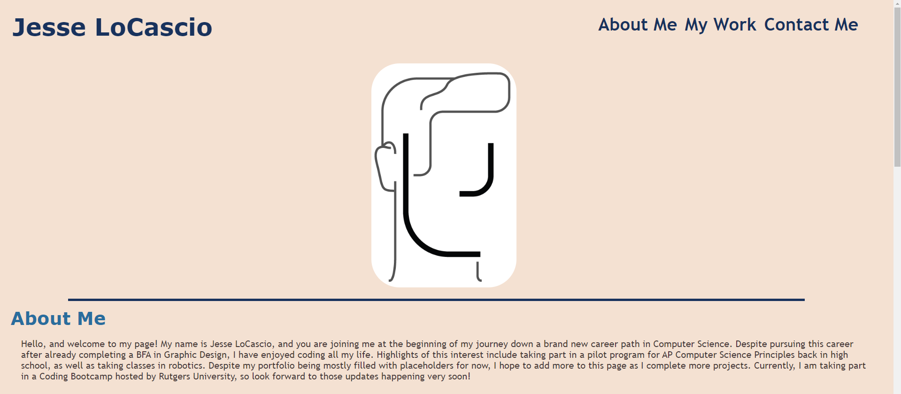
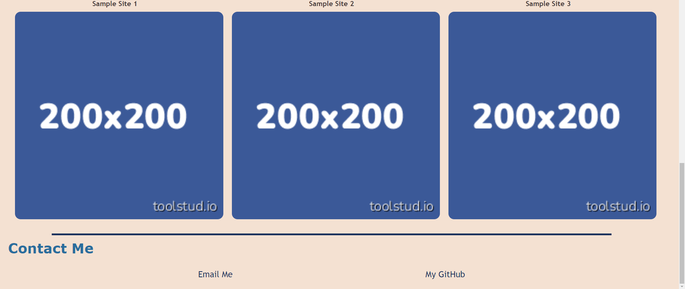

# Portfolio_Website

## Description

When creating this project, I set out to establish a reponsive and professional portfolio website for myself to be viewed by potential future employers. By completing this assignment, I learned how to set up and organize flex boxes, which I struggled with for a very long time.

## Installation

N/A

## Usage

To use this page, you can click on one of the internal links in the navigation bar (or simply scroll) to one of the three sections on the website: *About Me*, *My Work*, and *Contact Me*. While the *About Me* section is purely for page-viewers to read, the *My Work* and *Contact Me* sections have eternal links that can be clicked on. By either clicking on the project images or titles in the *My Work* section, you are taken to pages of previous projects I have completed that show off my skills. In the *Contact Me* section, you can click on the "Email Me" or "My GitHub" buttons to send me an email, and visit my GitHub page, respectively.

You can access the website here: https://jeslocascio.github.io/Portfolio_Website/

The webpage should look like this:

## Credits

Robert Kaiser helped me establish a basis for my navigation bar.

Daniel Merkin helped me set up and understand the fundamentals of flex boxes.

The Sample Image for the placeholder project boxes was taken from toolstud.io 

## License

MIT License

Please refer to the LICENSE in the repo for more information.

## Features

Internal and External Navigation Links